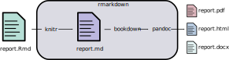

## What's a reproducible report?

For the purposes of this guide, a report is a scientific document that contains not only the text that makes up the manuscript, but it also contains the code that generates the figures and the statistics that are reported in your manuscript. Ideally, the report is part of a self-contained project that may contain your data, your initial exploratory analyses, and the final product.

This manuscript can be a scientific article, a conference presentation, a technical report, or a document to share your progress with your collaborators. The end product may not show any code and therefore it may not look like it was generated no differently from other documents.

Typically a report contains code for data manipulation, data analysis, and figure generation alongside the text that constitutes the heart of the report. Because of this hybrid nature, if left unchecked, this mix can lead to a big mess that is difficult to maintain and debug. In this guide, we will provide you with some advice on how to keep your report manageable.


---

Box ##: What is the difference between repeatability and reproducibility?

**Repeatability** describes how close are the results of an experiment conducted under the same conditions (same instruments, same operators, etc.). **Reproducibility** describes how close are the results of an experiment conducted under similar but different conditions. Repeatability ensures that you would obtain similar results when running your code on your own laptop at different times; while reproducibility ensures that giving your code to someone else would allow them to obtain the same results as yours.

---


## Why a reproducible report?

Did you ever have to redo an analysis 6 months later, and it was difficult. You forgot which one of the 15 files with "final" in their names was really the one you should have used? Have you ever spent several hours assembling an intricate figure with your favorite drawing program, just to realize that your collaborators had forgotten to send you the latest batch of data? Writing a reproducible report alleviates some of these hurdles. By automating how the figures and the statistics in your report are generated, you are leaving a code trail that you, your collaborators, or your readers can take and lead to your original data. This path to the raw data increases the transparency of your science. However, in order for the six-month-in-the-future you, your collaborators, and your readers, to be able to take this path, it is important that you organize your code and your data files consistently.

Not only writing a reproducible report increases the transparency of your science, it reduces the mistakes that result from copying and pasting across software. Keeping the content of your manuscript in sync with the output of your statistical program is challenging. By specifying directly the output of your model in your text, it is easier to make sure you are referring to the correct model with the correct parameters. To be the devil's advocate, one could argue that the additional code that will need to be written to integrate the results within the text could also lead to mistake. However, these coding mistakes are possible to detect (contrary to mistakes done by copying and pasting the correct numbers), and its consequences can be assessed by re-running the generation of the mansucript after fixing it.

Writing a reproducible report allows you to tell a much richer story than the narrative in the report by itself does. The text in your report tells does not usually show the different approaches and analyses you have tried before coming up with the final results. With a reproducible report, you can provide readers who want to know more about how you obtain the results in your paper about the approaches you tried and the their results. These can be included as supplementary material or tagged in the history of your version control system.

To make your report reproducible, your code will need to be self-contained. As a consequence, you will be able to re-use the code you wrote for one project in another one. Therefore, if initially it might slow you down to make your code reproducible, it is an investment in the future as you will be able to re-use and build up on it in the future. Additionally, others might be able to also re-use your code, and apply it for their own data. Your efforts may speed up the overall scientific process (you or your colleagues won't need to re-invent the wheel for each project), and you could get more citations on your papers.

It can feel daunting to get started with writing a reproducible report because of the technical skills and knowledge required. However, a partially reproducible report is better than a non-reproducible one. So each step you take towards reproducibility is worth taking, and sets you up to take the next one for the next project.


## How to do a report?


There are as many ways to approach a reproducible report as there are scientists. However, there are general princples that will help you produce a reproducible report. As the number of scientists who are writing reproducible manuscripts increases, there are more examples that are publicly available that you can study and use to set up your analysis.

One of the challenges of any scientific enterprise is that it can be difficult to know in advance what will be in the final version of your manuscript. However, some initial planning of your analysis plan will be helpful to getting your data, scripts, results, figures and text organized. Things will probably change as your analysis progresses, but having this initial plan will help you.

### Choose a directory structure to organize your projects

Depending of your field, the tools you use, and your preferences, you may need to adapt these recommendations, but in general your project will contain at least a variation of:

* **raw-data** directory that will contain your raw data. This is the data as
  they have been collected/entered in the spreadsheet/database. These data
  should never been modified by hand. They are the starting point of your
  analyses.
* **data** or **processed-data** these will be your modified raw data. Some
  scripts in your analysis will transform the raw data into these processed
  data. These scripts will for instance reformat the data in a "tidy" format,
  remove outliers and missing points as needed, fix spelling mistakes.
* **figures** will be the folder where all the figures to be used in the main
  text or as supplementary material will be generated.
* **src**, **R**, **scripts**, (or similar) will contain the code that you write
  for your analysis.

The manuscript itself could be stored inside a **doc** or similar folder. However, because of the way R works, I find it easier to store the manuscript file at the root of the project directory.

All your files should be contained within this folder, so you can easily share it with other people.


### Give informative names to your files

This is valid for your data files as well as your code, use short and informative names that clearly convey what your file contain. Making your file names consistent is easier for people to find their way around your project, and easier to write code to parse the content of the directories.


### Document the content of your files

In your code, write comments that describe that your scripts do, what is the format of the input for your functions, and what is the expected format of the output. For files that can't be commented easily, include README files in your directories that describe what is in each file, where the data is coming from, links to relevant papers or data repositories, the units of the measures included in the columns.


### Take advantage of litterate programming

When writing your report avoid to "hard code" any values in your manuscript and instead generate them directly. For instance, instead of writing "we analyzed 19864 observations", write "we analyzed `r nrow(toad_survival)` observations". RMarkdown also supports parameters which can be useful to develop the report on a subset of the data so it can be assembled quickly, but you can easily switch to the full dataset by only changing the value of one variable.


### Write functions for everything

As mentioned earlier, take advantage of R's functional approach to make each step of your analysis a function. It allows you to minimize the number of global variables that will be in your environment and therefore minimize the chance of using the incorrect value in your calculations. Functions also make your intentions more explicit, because it forces you to break down your analysis into smaller tasks. By having, small functions that only do one thing, you can have more control and reduce the chances of introducing bugs: for instance you can test the format of the input and of the output of your functions allowing you to test that they behave as expected. You can then build on complexity by putting these functions together. If you give them explicit names, then you build up the complexity of your project by stringing together these small modular pieces. By writing functions, you also make it easier to re-use your code within your project, so if you have to fix your code, you'll only have to fix it in one place.


### Use version control

Version control allows you to record the history of your project, and to go back to previous version of your code, allowing you to pinpoint where and when you made a change that started to break your code. Historically, version control has been developed to keep track of the development of code, but it works relatively well to also keep track of the text of your manuscript. Currently, git is the most popular version control software, and GitHub is a service that allows you to host and share your projects versioned with git easily.


## How to use RMardown?

The previous section gave general advice on best practices to write reproducible reports, here we will focus on how to apply them in R. Currently, the most common way people practice litterate programming in R is through RMarkdown.

RMarkdown is a file format (typically saved with the `Rmd` extension) that can contain: a YAML header, text, code chunks, and inline code. The `rmarkdown` package converts this file into a report most commonly into HTML or PDF.

The `rmarkdown` package automates a multi-step process (Fig. xx). Under the hood, it calls the `knitr` package that converts the Rmd file into a markdown file. In the process, `knitr` takes all the code chunks and the inline code, run them through R (or other programs), capture their output, and incorporates them in the report. Afterwards, `rmarkdown` calls the pandoc program (it is an external program that is not related to R) that can take the markdown file and converts to a variety of formats. For pandoc to generate PDF files, you will need a functional installation of LaTeX that you will need to install separately.




### the YAML header

The YAML header is at the top of your file, it is delineated by three dashes (`---`) at the top and at the bottom of it. It is optional, but can be used to specify:

* the characterstics of your document: the title, authors, date of creation.
* the arguments to pass to pandoc to control the format of the output as
  well as additional information such as the bibliography file and the
  formatting of the list of references.
* parameters for your report


### Code chunks

Code chunks are	interspaced within the text of the report. They are delineated by three backticks (` ``` `) at the top and at the bottom of it. The top backticks are followed by a curly bracket that specify: (1) the language in which the code chunk is written, (2) the name of the chunk (optional but good practice), (3) `knitr` options that control whether and how the code, the output, or the figure are interpreted and displayed.


### How to deal with figures?

The `knitr` package provides many options to finely control how your figures are going to be generated. Some of `knitr`'s options can be set individually for each chunk or be set globally. For a reproducible report, it is common practice to have chunk at the beginning of the report that sets default options for the figures. For instance the following chunk will do the following:

- all the figures generated by the report will be placed in the `figures/` sub-directory
- all the figures will be 6.5 x 4 inches and centered in the text.


    ```{r figure-setup, echo=FALSE, include=FALSE}
    knitr::opts_chunk$set(fig.path="figures/", fig.width=6.5,
                          fig.height=4, fig.align="center")
   ```


Additionally, this chunk will be named `figure-setup`, and we use the `echo=FALSE` option so the code for the chunk will not be displayed in the report, and use the `include=FALSE` option so no output produced by this chunk will be included in the report.


### How to deal with tables?


### How to deal with citations?

### How to deal with cross-references?


## How to work with collaborators?

## How to get started?

# Dependency management

* Reproducibility is also about making sure someone else can re-use your code to
  obtain the same results as yours. Understanding why this might not be the case
  can be useful to determine how careful you need to be in documenting your
  setup.

* For someone else to be able to reproduce the results from your code, you'd
  need more than just the code. You'd also need to specify the exact packages
  you used, the version of the software, and potentially your operating system.

* R itself is very stable, but there are still default that changes. R packages
  are much less stable, and it's not good practice, but it happen often that the
  behavior of functions change completely.

* Dependencies as a way to document the setup you used to produce your results,
  vs. to help others recreate your analysis.

## How to make your code self contained?

* Do not use `setwd()`, instead use Rproj (but not needed)
* Use relative paths
* Document where the data is coming from, how it is formatted, what are the
  units

## How to document your dependencies?

* Good: report the output of your `session_info`
* Better: use packrat or other package managers (drat, miniCRAN, checkpoint...)


---

Resources:
* Best practices for Scientific Computing (http://journals.plos.org/plosbiology/article?id=10.1371/journal.pbio.1001745)
* Good enough practices for Scientific Computing (https://swcarpentry.github.io/good-enough-practices-in-scientific-computing/)
* 10 simples rules for reproducible computational research: http://journals.plos.org/ploscompbiol/article?id=10.1371/journal.pcbi.1003285
* A quick guide to organizing computational biology projects: http://journals.plos.org/ploscompbiol/article?id=10.1371/journal.pcbi.1000424
* Ten Simple Rules for Digital Data Storage (http://journals.plos.org/ploscompbiol/article?id=10.1371/journal.pcbi.1005097)
